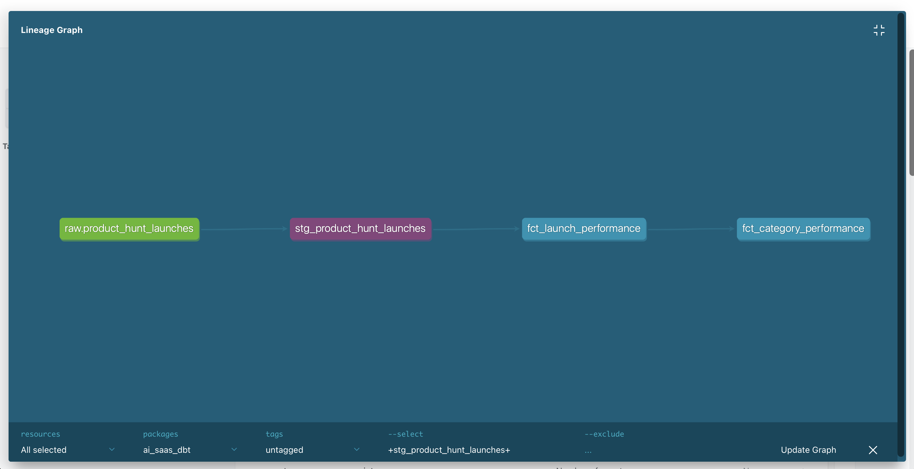

# AI SaaS Retention & Competitive Intelligence Analytics Platform


An end-to-end analytics engineering project that simulates what a real B2C SaaS data team would build — from raw data ingestion to product insights.

---

## 🎯 Problem Statement

B2C AI apps struggle with retention. This platform answers three questions:
1. What early engagement patterns predict whether users will stick around?
2. How does product positioning relate to adoption and longevity?
3. Can we build a reliable metrics layer that product teams can actually trust?

---

## 🔑 Key Findings

- **70% of users churn within their first month** — a classic retention cliff
- **Power Users survive 8x longer than New Users** — habit formation is the key driver
- **Total reviews is the #1 churn predictor** — frequency of engagement matters more than quality
- **Median survival time: 13.4 months** for users who return at least once
- **Open Source and Augmented Reality** tools have the highest Product Hunt success scores

---

## 🏗️ Architecture

```
[Product Hunt API]          [Yelp Dataset (500k+ events)]
        ↓                              ↓
   raw schema                     raw schema
   (PostgreSQL)                   (PostgreSQL)
        ↓                              ↓
   staging (dbt)               staging (dbt)
   - stg_product_hunt_launches  - stg_yelp_reviews
                                - stg_yelp_users
                    ↘            ↙
                  marts (dbt)
                  - fct_launch_performance
                  - fct_category_performance
                  - fct_retention_cohorts
                  - fct_survival_inputs
                         ↓
            ┌────────────┴────────────┐
     Analysis (Python)        Streamlit Dashboard
     - Kaplan-Meier            - Retention cohorts
     - XGBoost churn           - Survival curves
       prediction              - Competitive intel
```

---

## 🛠️ Tech Stack

| Layer | Tool | Purpose |
|-------|------|---------|
| Warehouse | PostgreSQL (Snowflake migration planned) | Local data warehouse |
| Transformation | dbt Core | Modeling, testing, lineage |
| Ingestion | Python (requests, psycopg2) | API + file ingestion |
| Survival Analysis | lifelines | Kaplan-Meier curves |
| ML Model | XGBoost + scikit-learn | Churn prediction (0.71 AUC-ROC) |
| Dashboard | Streamlit + Plotly | Interactive visualizations |
| Observability | dbt-expectations | Advanced data quality tests |
| CI/CD | GitHub Actions | Runs 42 tests on every push |

---

## 📊 Data Sources

- **Product Hunt API (GraphQL)** — Real AI tool launches with upvotes, categories, pricing
- **Yelp Academic Dataset** — 500,000+ reviews and users as behavioral engagement proxy

---

## 🗂️ Project Structure

```
AI-Product-Retention-Analytics/
├── ingestion/
│   ├── product_hunt_ingest.py   # Product Hunt API ingestion
│   └── yelp_ingest.py           # Yelp dataset bulk loader
├── ai_saas_dbt/
│   ├── models/
│   │   ├── staging/             # Cleaning + standardization
│   │   └── marts/               # Business metrics + KPIs
│   ├── dbt_project.yml
│   └── profiles.yml
├── analysis/
│   ├── survival_analysis.py     # Kaplan-Meier survival curves
│   └── churn_prediction.py      # XGBoost churn prediction
├── dashboard/
│   └── app.py                   # Streamlit dashboard
├── .github/
│   └── workflows/
│       └── dbt_ci.yml           # CI/CD pipeline
├── NOTES.md                     # Learning notes
└── README.md
```

---

## 🚀 How to Run

### Prerequisites
- Python 3.9+
- PostgreSQL 16
- dbt-postgres

### Setup

1. Clone the repository:
```bash
git clone https://github.com/AnirudhHegde20/AI-Product-Retention-Analytics.git
cd AI-Product-Retention-Analytics
```

2. Create virtual environment:
```bash
python -m venv .venv
source .venv/bin/activate
pip install -r requirements.txt
```

3. Set up PostgreSQL:
```bash
createdb ai_saas_analytics
psql -d ai_saas_analytics -c "CREATE SCHEMA IF NOT EXISTS raw; CREATE SCHEMA IF NOT EXISTS staging; CREATE SCHEMA IF NOT EXISTS marts;"
```

4. Configure credentials:
```bash
cp .env.example .env
# Add your Product Hunt API token to .env
```

5. Run ingestion:
```bash
python ingestion/product_hunt_ingest.py
python ingestion/yelp_ingest.py
```

6. Run dbt:
```bash
cd ai_saas_dbt
dbt build
```

7. Launch dashboard:
```bash
cd ..
streamlit run dashboard/app.py
```

---

## 📈 dbt Lineage Graph



---

## 🧪 Data Quality

- **42 automated dbt tests** running on every build
- Tests include: `not_null`, `unique`, `accepted_values`, `expect_table_row_count_to_be_between`, `expect_column_values_to_be_between`, `expect_table_columns_to_match_ordered_list`
- CI/CD via GitHub Actions runs `dbt build` on every push to `main`
- Defense in depth: database constraints + dbt tests + dbt-expectations at three separate layers

---

## 💡 What I Learned

- Warehouse layering (raw → staging → marts) and why immutability of raw data matters
- dbt source contracts, lineage tracking, and materialization strategies
- Idempotent ingestion patterns with ON CONFLICT DO NOTHING
- Batch processing for large datasets (500k+ rows)
- Kaplan-Meier survival analysis applied to product retention
- XGBoost churn prediction with feature importance analysis
- CI/CD pipeline design with GitHub Actions
- Defense in depth data quality strategy

---

## 🔮 Future Improvements (V2)

- [ ] Migrate to Snowflake for cloud-scale processing (full 6M+ Yelp dataset)
- [ ] Deploy Streamlit dashboard to Streamlit Cloud (live demo URL)
- [ ] Add Prefect orchestration for scheduled pipeline runs
- [ ] Add A/B test analysis layer
- [ ] SHAP values for XGBoost model interpretability

---
